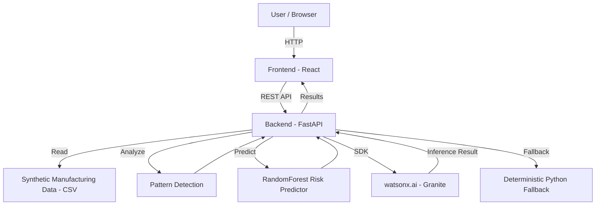

# Architecture

## System Architecture

The system connects the engineer dashboard built with React to the FastAPI backend, manufacturing data, ML analysis, and IBM watsonx.ai for grounded engineering insights.

## Components

| Component | Technology | Responsibility |
|---|---|---|
| Frontend | React | Engineer dashboard, data visualization and user interaction |
| Backend API | FastAPI | Business logic, orchestration and REST APIs |
| AI / ML | RandomForest, watsonx.ai Granite | Yield-risk prediction, pattern detection, root-cause analysis and explanations |
| Data Processing | Python, pandas, NumPy | Processing wafer, sensor, process parameter and defect data |
| Pattern Detection | Python | Identifying anomalies, correlations and probable root causes |
| Fallback | Python | Deterministic evidence-based responses when watsonx.ai is unavailable |

## Data Flow

1. Wafer lot, sensor, process parameter and defect data are loaded from CSV files.
2. The React dashboard sends analysis requests to the FastAPI backend through REST APIs.
3. FastAPI preprocesses and organizes the manufacturing data for analysis.
4. Pattern detection identifies anomalies, correlations and probable root causes.
5. The RandomForest model predicts upcoming batch low-yield risk and contributing process factors.
6. Relevant manufacturing evidence is sent to watsonx.ai Granite for grounded engineering insights.
7. If watsonx.ai is unavailable, the deterministic Python fallback generates an evidence-based response.
8. FastAPI combines the analysis results and returns them to the React dashboard.
9. React displays yield risk, root causes, defect patterns and recommended corrective actions.

## Security Considerations

- API keys and watsonx.ai credentials are stored in environment variables, never committed to Git.
- Credentials are never exposed in the React frontend.
- `.env` files are protected through `.gitignore`.
- AI responses are grounded using application-generated manufacturing evidence.
- React communicates with the FastAPI backend through REST APIs rather than directly accessing AI credentials.

## Scalability Notes

The FastAPI backend is stateless and can be horizontally scaled behind a load balancer. The current CSV-based data layer can be replaced with a production database or manufacturing data lake as data volume increases. Pattern detection and RandomForest inference can be scaled independently, while watsonx.ai inference can be optimized through request batching, caching and asynchronous processing.
